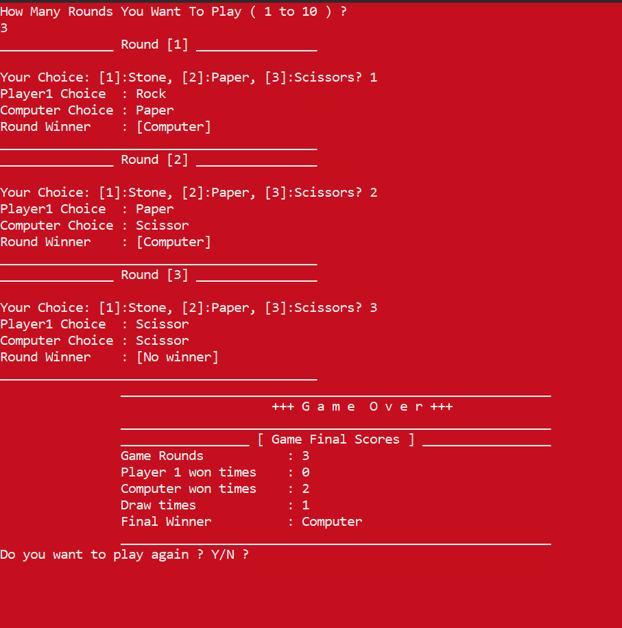

# Rock, Paper, Scissor Game
## Description
This is a simple implementation of the Rock, Paper, Scissors game in C++, where the user competes against the computer. The game is played for a user-defined number of rounds (1 to 10), and the final winner is announced based on the results of each round. The game supports multiple rounds and displays colorful outputs based on the outcome of each round (Player, Computer, or Draw).

## Features
- Color-coded outcomes: The result of each round and the final winner are displayed with distinct colors (green for player win, red for computer win, yellow for draw).
- Interactive gameplay: The user chooses between Rock, Paper, and Scissors, and the computer makes a random choice.
- Multiple rounds: The user can choose how many rounds to play, with options ranging from 1 to 10.
- Replay option: After the game ends, the user is asked if they want to play again.

## Logic
- The program will ask for the number of rounds to play (between 1 and 10).
- After each round, the game will display:
+ The player's choice and the computer's choice.
+ The result of the round (who won or if it's a draw).
+ At the end of all rounds, the program will display the final score and the overall winner.

## Output

